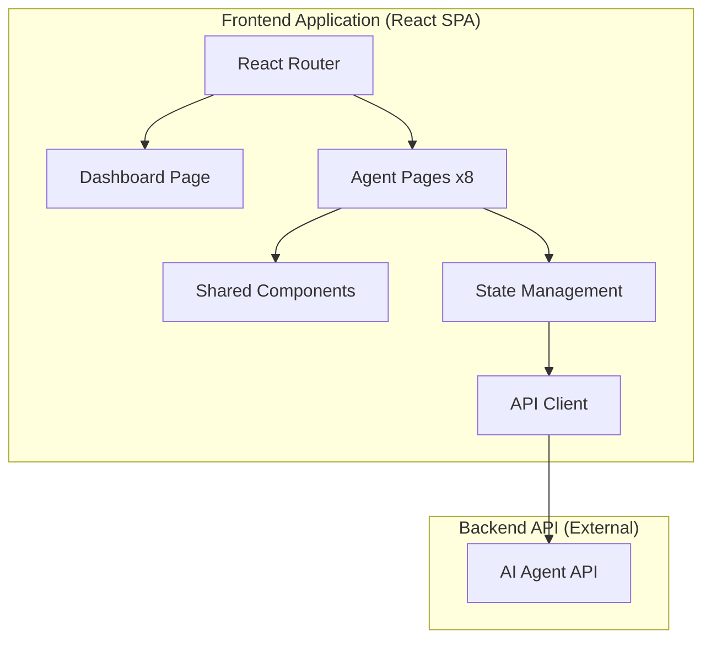

# Design Document: DevOps AI Agents Frontend

## Overview

This document describes the design for a frontend application providing 8 specialized AI Agent interfaces for DevOps operations. The application is built as a single-page application (SPA) with React, featuring a dashboard landing page and dedicated chat interfaces for each AI Agent. Each agent specializes in a specific DevOps domain: CI/CD, Infrastructure, Monitoring, Security, Containers, Cloud, Configuration Management, and Incident Response.

## Architecture

### High-Level Architecture



### Technology Stack

- **Framework**: React 18+ with TypeScript
- **Routing**: React Router v6
- **State Management**: React Context + useReducer for chat state
- **Styling**: Tailwind CSS for responsive design
- **Code Highlighting**: Prism.js or highlight.js for syntax highlighting
- **Build Tool**: Vite
- **Testing**: Vitest + React Testing Library + fast-check (property-based testing)

### Application Structure

```
src/
├── components/
│   ├── common/
│   │   ├── ChatInterface.tsx
│   │   ├── ChatMessage.tsx
│   │   ├── CodeBlock.tsx
│   │   ├── MessageInput.tsx
│   │   └── Navigation.tsx
│   ├── dashboard/
│   │   ├── AgentCard.tsx
│   │   └── Dashboard.tsx
│   └── layout/
│       ├── Layout.tsx
│       ├── Sidebar.tsx
│       └── Header.tsx
├── pages/
│   ├── DashboardPage.tsx
│   └── AgentPage.tsx
├── context/
│   ├── ChatContext.tsx
│   └── AgentContext.tsx
├── hooks/
│   ├── useChat.ts
│   └── useAgent.ts
├── services/
│   └── agentApi.ts
├── types/
│   └── index.ts
├── data/
│   └── agents.ts
├── utils/
│   └── formatters.ts
├── App.tsx
└── main.tsx
```

## Components and Interfaces

### Core Types

```typescript
// types/index.ts

export type AgentType = 
  | 'cicd' 
  | 'infrastructure' 
  | 'monitoring' 
  | 'security' 
  | 'container' 
  | 'cloud' 
  | 'config' 
  | 'incident';

export interface Agent {
  id: AgentType;
  name: string;
  description: string;
  icon: string;
  color: string;
  examplePrompts: string[];
  specialization: string;
}

export interface Message {
  id: string;
  role: 'user' | 'agent';
  content: string;
  timestamp: Date;
  agentId: AgentType;
}

export interface ChatState {
  messages: Record<AgentType, Message[]>;
  isLoading: Record<AgentType, boolean>;
}

export interface ChatContextValue {
  state: ChatState;
  sendMessage: (agentId: AgentType, content: string) => Promise<void>;
  clearHistory: (agentId: AgentType) => void;
}
```

### Agent Data Configuration

```typescript
// data/agents.ts

export const agents: Agent[] = [
  {
    id: 'cicd',
    name: 'CI/CD Agent',
    description: 'Pipeline configuration and deployment automation',
    icon: 'GitBranch',
    color: 'blue',
    specialization: 'Continuous Integration and Continuous Deployment',
    examplePrompts: [
      'How do I set up a GitHub Actions workflow?',
      'Create a Jenkins pipeline for a Node.js app',
      'Best practices for blue-green deployments'
    ]
  },
  {
    id: 'infrastructure',
    name: 'Infrastructure Agent',
    description: 'Infrastructure as Code and provisioning',
    icon: 'Server',
    color: 'green',
    specialization: 'Infrastructure as Code and Cloud Provisioning',
    examplePrompts: [
      'Write a Terraform module for an AWS VPC',
      'How to manage state in Terraform?',
      'CloudFormation vs Terraform comparison'
    ]
  },
  {
    id: 'monitoring',
    name: 'Monitoring Agent',
    description: 'Observability, logging, and metrics',
    icon: 'Activity',
    color: 'yellow',
    specialization: 'Observability, Logging, and Metrics',
    examplePrompts: [
      'Set up Prometheus alerting rules',
      'Best practices for structured logging',
      'Create a Grafana dashboard for API metrics'
    ]
  },
  {
    id: 'security',
    name: 'Security Agent',
    description: 'DevSecOps and security practices',
    icon: 'Shield',
    color: 'red',
    specialization: 'DevSecOps and Security Best Practices',
    examplePrompts: [
      'How to implement secrets management?',
      'Security scanning in CI/CD pipelines',
      'Container security best practices'
    ]
  },
  {
    id: 'container',
    name: 'Container Agent',
    description: 'Docker, Kubernetes, and orchestration',
    icon: 'Box',
    color: 'cyan',
    specialization: 'Containerization and Orchestration',
    examplePrompts: [
      'Optimize a Dockerfile for production',
      'Kubernetes deployment strategies',
      'How to set up Helm charts?'
    ]
  },
  {
    id: 'cloud',
    name: 'Cloud Agent',
    description: 'AWS, Azure, GCP management',
    icon: 'Cloud',
    color: 'purple',
    specialization: 'Cloud Platform Management',
    examplePrompts: [
      'Compare AWS Lambda vs Azure Functions',
      'Set up cross-account IAM roles',
      'GCP networking best practices'
    ]
  },
  {
    id: 'config',
    name: 'Config Agent',
    description: 'Ansible, Terraform, Chef configuration',
    icon: 'Settings',
    color: 'orange',
    specialization: 'Configuration Management',
    examplePrompts: [
      'Write an Ansible playbook for nginx',
      'Chef cookbook structure best practices',
      'Puppet vs Ansible comparison'
    ]
  },
  {
    id: 'incident',
    name: 'Incident Agent',
    description: 'Incident response and troubleshooting',
    icon: 'AlertTriangle',
    color: 'pink',
    specialization: 'Incident Response and Troubleshooting',
    examplePrompts: [
      'Create an incident response runbook',
      'How to perform a post-mortem?',
      'Troubleshoot high CPU usage'
    ]
  }
];
```

### Key Components

#### ChatInterface Component

```typescript
interface ChatInterfaceProps {
  agentId: AgentType;
  agent: Agent;
}

// Renders the chat UI with message history, input field, and agent context
// Uses ChatContext for state management
// Handles message submission and display
```

#### AgentCard Component

```typescript
interface AgentCardProps {
  agent: Agent;
  onClick: () => void;
}

// Renders a clickable card with agent info
// Displays name, icon, description
// Navigates to agent page on click
```

#### CodeBlock Component

```typescript
interface CodeBlockProps {
  code: string;
  language?: string;
}

// Renders syntax-highlighted code
// Auto-detects language if not specified
// Supports copy-to-clipboard functionality
```

#### Navigation Component

```typescript
interface NavigationProps {
  currentAgent?: AgentType;
  isMobile?: boolean;
}

// Renders navigation links to all agents
// Highlights current agent
// Adapts to mobile/desktop layouts
```

## Data Models

### Message Model

| Field | Type | Description |
|-------|------|-------------|
| id | string | Unique identifier (UUID) |
| role | 'user' \| 'agent' | Message sender type |
| content | string | Message text content |
| timestamp | Date | When message was sent |
| agentId | AgentType | Which agent this message belongs to |

### Agent Model

| Field | Type | Description |
|-------|------|-------------|
| id | AgentType | Unique agent identifier |
| name | string | Display name |
| description | string | Brief description |
| icon | string | Icon identifier |
| color | string | Theme color |
| examplePrompts | string[] | Suggested prompts |
| specialization | string | Detailed specialization text |

### Chat State Model

| Field | Type | Description |
|-------|------|-------------|
| messages | Record<AgentType, Message[]> | Messages per agent |
| isLoading | Record<AgentType, boolean> | Loading state per agent |

## Correctness Properties

*A property is a characteristic or behavior that should hold true across all valid executions of a system-essentially, a formal statement about what the system should do. Properties serve as the bridge between human-readable specifications and machine-verifiable correctness guarantees.*

### Property 1: Dashboard displays all agents
*For any* render of the Dashboard component, the output SHALL contain exactly 8 agent cards, one for each defined agent type.
**Validates: Requirements 1.1**

### Property 2: Agent card contains required information
*For any* agent data object, when rendered as an AgentCard, the output SHALL contain the agent's name, icon identifier, and description text.
**Validates: Requirements 1.2**

### Property 3: Agent card navigation
*For any* agent card click event, the resulting navigation SHALL route to the path `/agent/{agentId}` where agentId matches the clicked agent's id.
**Validates: Requirements 1.3**

### Property 4: Message submission adds to history
*For any* valid message string submitted to any agent, the chat state SHALL contain that message in the corresponding agent's message array immediately after submission.
**Validates: Requirements 10.2**

### Property 5: Agent response visual distinction
*For any* message in chat history, messages with role 'agent' SHALL have a different CSS class than messages with role 'user'.
**Validates: Requirements 10.3**

### Property 6: Chat history persistence round-trip
*For any* chat history state, serializing to session storage and deserializing SHALL produce an equivalent state object.
**Validates: Requirements 10.5**

### Property 7: Navigation shows all agents
*For any* agent page render, the navigation component SHALL contain links to all 8 agents.
**Validates: Requirements 11.1**

### Property 8: Navigation link routing
*For any* navigation link click, the resulting route SHALL match the agent id of the clicked link.
**Validates: Requirements 11.2**

### Property 9: Independent chat history preservation
*For any* sequence of agent page navigations, each agent's message array SHALL remain unchanged when navigating away and back.
**Validates: Requirements 11.3**

### Property 10: Active agent highlighting
*For any* agent page with agentId X, the navigation component SHALL apply an 'active' class only to the link for agent X.
**Validates: Requirements 11.4**

### Property 11: Code block syntax highlighting
*For any* message content containing code blocks (markdown fenced code), the rendered output SHALL wrap code in syntax-highlighted elements.
**Validates: Requirements 2.4, 3.4, 4.4, 5.4, 6.4, 7.4, 8.4, 9.4**

### Property 12: Message-response flow
*For any* agent and any non-empty message string, calling sendMessage SHALL eventually result in a response message being added to that agent's history.
**Validates: Requirements 2.2, 3.2, 4.2, 5.2, 6.2, 7.2, 8.2, 9.2**

## Error Handling

### Network Errors
- Display user-friendly error message in chat when API calls fail
- Implement retry mechanism with exponential backoff
- Show loading indicator during API calls
- Allow user to retry failed message sends

### Input Validation
- Prevent submission of empty messages
- Trim whitespace from message input
- Limit message length to prevent abuse (max 4000 characters)

### State Errors
- Gracefully handle corrupted session storage data
- Reset to default state if deserialization fails
- Log errors for debugging without exposing to users

### Navigation Errors
- Handle invalid agent IDs in URL with redirect to dashboard
- Show 404-style message for unknown routes

## Testing Strategy

### Unit Testing with Vitest + React Testing Library

Unit tests will verify specific component behaviors and edge cases:

- Component rendering tests for each component
- Event handler tests for user interactions
- Utility function tests for formatters and helpers
- Hook tests for custom hooks

### Property-Based Testing with fast-check

Property-based tests will verify universal properties across all inputs:

- **Library**: fast-check (JavaScript property-based testing library)
- **Minimum iterations**: 100 per property test
- **Test annotation format**: `// **Feature: devops-ai-agents-frontend, Property {N}: {description}**`

Each correctness property from the design will be implemented as a property-based test that generates random valid inputs and verifies the property holds.

### Test Organization

```
src/
├── __tests__/
│   ├── components/
│   │   ├── AgentCard.test.tsx
│   │   ├── ChatInterface.test.tsx
│   │   ├── CodeBlock.test.tsx
│   │   └── Navigation.test.tsx
│   ├── pages/
│   │   ├── Dashboard.test.tsx
│   │   └── AgentPage.test.tsx
│   ├── hooks/
│   │   └── useChat.test.ts
│   └── properties/
│       ├── dashboard.property.test.ts
│       ├── chat.property.test.ts
│       └── navigation.property.test.ts
```

### Test Coverage Goals

- Unit tests: Cover all components, hooks, and utility functions
- Property tests: Cover all 12 correctness properties
- Integration tests: Cover critical user flows (dashboard → agent → chat)
